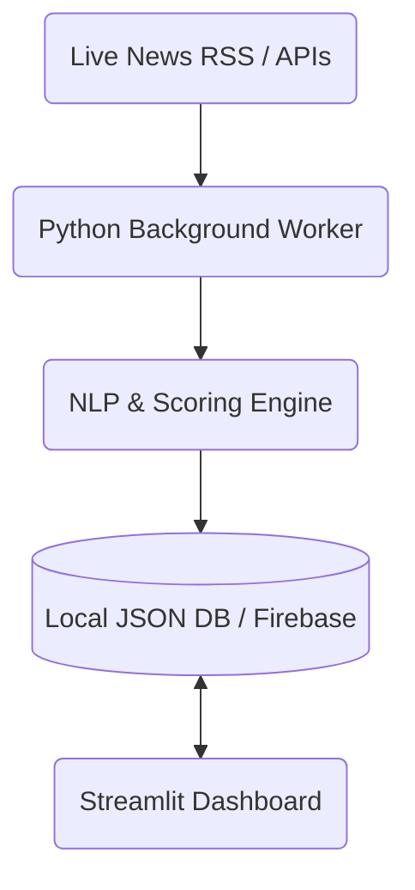

# 📡 SupplyRadar

> **Live Demo:** [https://supplyradar.streamlit.app/](https://supplyradar.streamlit.app/)
> 
> **Real-Time, AI-Powered Supply Chain Intelligence Platform**


SupplyRadar is a decoupled, enterprise-grade application that ingests global news in real-time, processes it using Natural Language Processing (NLP), and calculates personalized risk scores for supply chain disruptions based on user-defined watchlists and their specific industry. 

Instead of reading generic news, Supply Chain Managers receive immediate, actionable intelligence when *their specific* suppliers, ports, or commodities are affected by geopolitical conflicts, strikes, or shortages.

---

## ✨ Key Features

- **Smart Industry Intelligence**: Automatically queries global news feeds (Google News RSS, NewsAPI) to fetch disruption events tailored specifically to the user's selected industry (e.g., Hospitality & Procurement vs. Automotive).
- **Premium Glassmorphism UI**: A stunning, modern, responsive interface featuring an animated cyber-dark gradient and interactive elements designed for SaaS standards.
- **NLP Risk Engine**: Utilizes NLTK and VADER Sentiment Analysis to compute a "Hybrid Risk Score" by cross-referencing global events with the user's watchlist.
- **Data Cleansing ETL Pipeline**: Built-in Pandas showcase demonstrating automated cleaning of dirty procurement data.
- **Role-Based Analytics**: A secure, isolated "Procurement Analytics" module restricted exclusively to Hospitality & Procurement personnel, featuring Power BI-style interactive visualizations.
- **Geospatial Mapping**: Interactive, dynamic Folium maps visualizing where high-risk disruptions are geographically clustered globally.
- **Persistent Demo Mode**: Includes a custom-built, lightweight local JSON database engine (`core/demo_db.py`) allowing seamless testing of account persistence without requiring cloud infrastructure.
- **Decoupled Architecture**: 
  - **Headless Worker**: A background daemon (`worker.py`) constantly ingests, cleans, and scores data without blocking the UI.
  - **Lightning-Fast UI**: A decoupled Streamlit frontend that simply reads processed data.

---

## 🏗️ Architecture

SupplyRadar utilizes an event-driven, decoupled data pipeline:



## 🔐 Security 

This project implements strict database and route security:
- **Client-Side Auth**: Users authenticate securely via the Firebase REST API or the local Demo DB.
- **Intelligent Route Guards**: Certain modules (like Procurement Analytics) are actively blocked based on the logged-in user's industry profile.

---

## 🚀 Quickstart

### 1. Prerequisites
- Python 3.10+
- (Optional) Free Firebase Project for cloud deployment.

### 2. Installation
Clone the repository and install dependencies:
```bash
git clone https://github.com/your-username/SupplyRadar.git
cd SupplyRadar
pip install -r requirements.txt
python -m nltk.downloader punkt vader_lexicon
```

### 3. Configuration
1. Rename `.env.example` to `.env`.
2. (Optional) Add your `firebase-credentials.json` if using the cloud backend.

### 4. Running the Platform

**Start the User Interface**
Launch the Streamlit frontend. The app will automatically run in persistent Demo Mode if Firebase credentials aren't found:
```bash
streamlit run app.py
```


