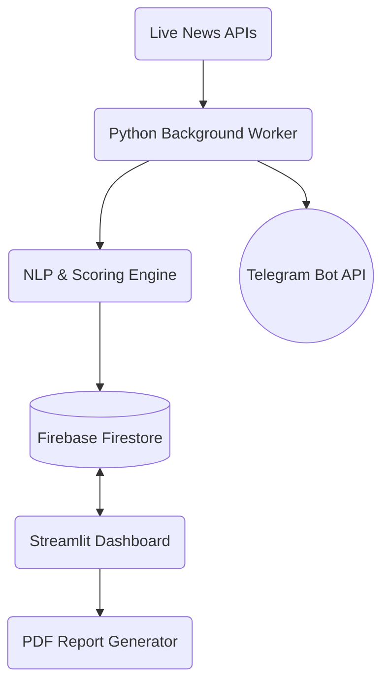

# 📡 SupplyRadar

> **Real-Time, AI-Powered Supply Chain Intelligence Platform**


SupplyRadar is a decoupled, enterprise-grade application that ingests global news in real-time, processes it using Natural Language Processing (NLP), and calculates personalized risk scores for supply chain disruptions based on user-defined watchlists. 

Instead of reading generic news, Supply Chain Managers receive immediate, actionable intelligence when *their specific* suppliers, ports, or commodities are affected.

---

## ✨ Key Features

- **Personalized Watchlists**: Users can specify exact companies (e.g., TSMC), ports (e.g., Shanghai), and commodities (e.g., Lithium) to track.
- **NLP Risk Engine**: Utilizes NLTK and VADER Sentiment Analysis to compute a "Hybrid Risk Score" by cross-referencing global events with the user's watchlist.
- **Decoupled Architecture**: 
  - **Headless Worker**: A background daemon (`worker.py`) constantly ingests, cleans, and scores data without blocking the UI.
  - **Lightning-Fast UI**: A decoupled Streamlit frontend that simply reads processed data from Firebase, completely avoiding API rate limits and loading latency.
- **Geospatial Mapping**: Interactive Folium maps to visualize where high-risk disruptions are geographically clustered.
- **Instant Telegram Alerts**: Push notifications sent instantly to users when a critical (High Risk) event occurs.
- **Executive PDF Summaries**: Dynamically generated, sanitized PDF reports using `FPDF2` for stakeholders.

---

## 🏗️ Architecture

SupplyRadar has evolved from a monolithic PoC into a robust, event-driven architecture:



## 🔐 Security 

This project implements strict database security:
- **Client-Side Auth**: Users authenticate securely via the Firebase REST API.
- **Firestore Rules**: All public R/W access is locked (`allow read, write: if false;`).
- **Backend Admin SDK**: Both the Streamlit frontend and the background worker communicate with Firebase via secure, server-side Service Account Credentials.

---

## 🚀 Quickstart

### 1. Prerequisites
- Python 3.10+
- A Free Firebase Project (with Email/Password Auth and Firestore enabled)
- API Keys for NewsAPI and Telegram (optional)

### 2. Installation
Clone the repository and install dependencies:
```bash
git clone https://github.com/your-username/SupplyRadar.git
cd SupplyRadar
pip install -r requirements.txt
python -m nltk.downloader punkt vader_lexicon
```

### 3. Configuration
1. Create a `.env` file based on `.env.example`.
2. Add your `firebase-credentials.json` to the root directory.
3. Deploy the `firestore.rules` file to your Firebase console.

### 4. Running the Platform

**Start the Background Worker (Daemon)**
This handles data ingestion and push notifications asynchronously:
```bash
python worker.py
```

**Start the User Interface**
In a separate terminal, launch the Streamlit frontend:
```bash
streamlit run app.py
```

---

## 👨‍💻 Contributing
Contributions are welcome! Please feel free to submit a Pull Request. If you plan on implementing a major feature (like replacing VADER with an LLM for extraction), please open an issue first to discuss the architecture.

## 📄 License
This project is licensed under the MIT License.
